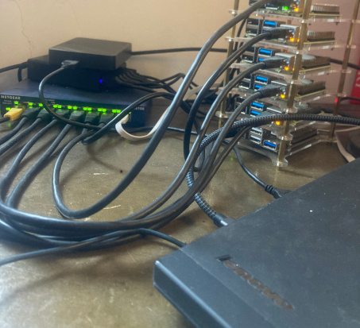

## Found Infrastructure

### Overview 
This is a digital humanities project, designed to help me learn about distributed computing and datascience. Its scripts are run on an open hardware project comprising a 7 node Raspberry Pi / Rock64 cluster and an upcycled 2011 ThinkPad x230. The https://www.dask.org framework is used for distributed computing. 

### Hardware
My goal is to learn about distributed computing but also reuse and upcycle as much existing kit as possible. The project was started in the context of global supply-chain issues related to the Covid-19 pandemic, as well as increasingly bad news about the climate-change emergency. The Pi and networking equipment were bought new but the cluster could be considered to be cobbled together 'found' infrastructure. The total available compute power is: 53GB RAM, 28 cores. No GPU, although there might be ways to add it. I generally run 7 workers, including one on the primary ThinkPad node. Debugging the full hardware + storage + network stack in addition to Python + Dask is challenging but proving to be an excellent learning experience (possibly ending in productive failure)!

- 7 node Raspberry Pi + Rock64 + Lenovo ThinkPad cluster.
- 1x 2011 Lenovo ThinkPad Intel® Core™ i7-3520M CPU @ 2.90GHz × 4. Upcycled with flashed Skulls Coreboot; 1TB SSD; 16GB RAM. Pop!_OS 22.04 LTS.
- 5x Raspberry Pi 4 Model B Rev 1.4. Broadcom BCM2711, Quad core Cortex-A72 (ARM v8) 64-bit SoC @ 1.8GHz. 32GB MicroSD. 8GB SDRAM. Raspbian GNU/Linux 11 (bullseye).
- 1x ROCK64. Rockchip RK3328 Quad-Core ARM Cortex A53 64-Bit Processor. 16GB MicroSD. 4GB RAM. Armbian 23.02.2 Jammy with Linux 5.15.93-rockchip64.
- The cluster is connected via  an 8 port Netgear network switch and ethernet, as described in <a href="https://magpi.raspberrypi.com/articles/build-a-raspberry-pi-cluster-computer">this MagPi Magazine article</a> .
- The ThinkPad was flashed with Skulls, as described in this <a href="https://famicoman.com/2020/07/30/corebooting-the-thinkpad-x230-with-skulls">famicoman.com post</a>.

